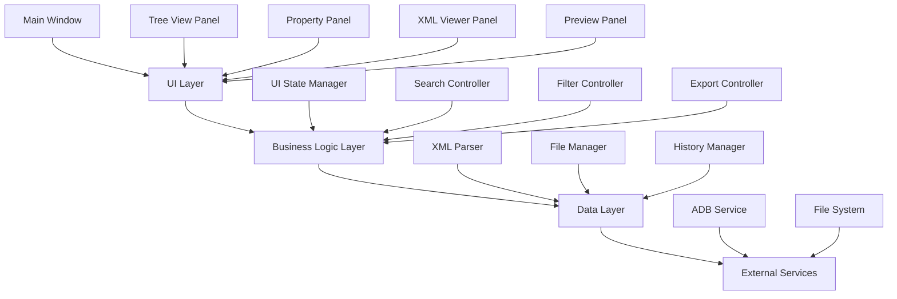
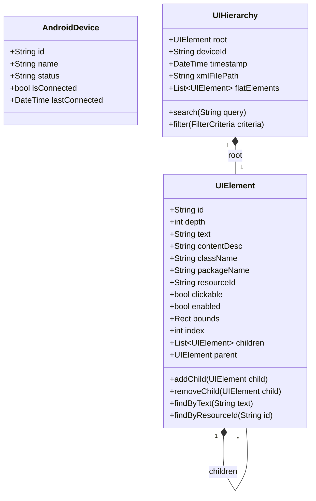
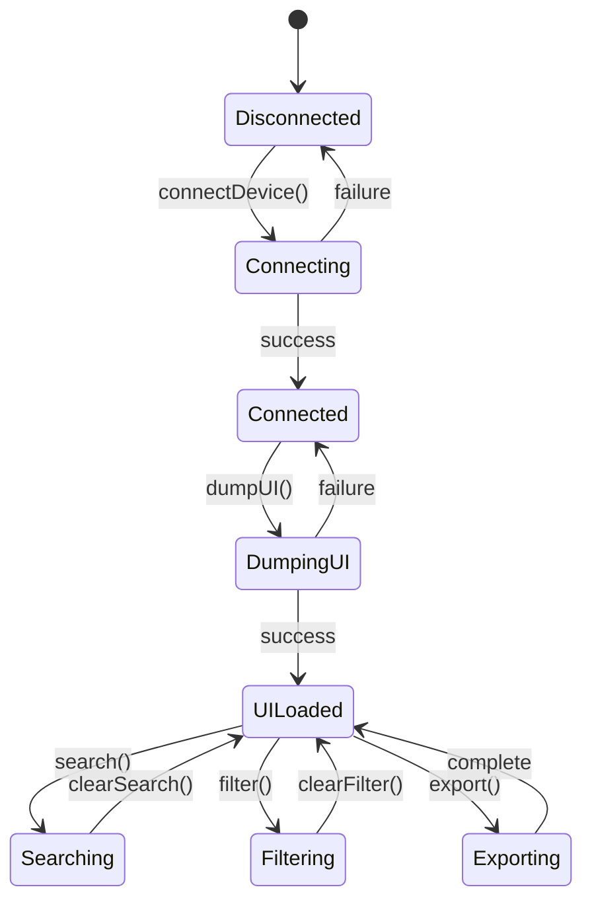

# Design Document

## Overview

本设计文档描述了Flutter版Mac UI分析工具的技术架构和实现方案。该工具基于现有Python脚本的功能，提供现代化的图形界面来分析Android应用的UI层次结构。

### 核心目标
- 提供直观的UI层次结构可视化
- 支持高效的搜索和过滤功能
- 实现XML语法高亮显示
- 提供良好的用户体验和性能

### 技术栈选择
- **框架**: Flutter 3.7.2+
- **平台**: macOS桌面应用
- **语言**: Dart
- **UI库**: Material Design 3
- **状态管理**: Provider/Riverpod
- **XML解析**: dart:xml
- **进程调用**: dart:io Process
- **语法高亮**: flutter_highlight包

## Architecture

### 整体架构



### 分层设计

#### 1. UI Layer (表现层)
- **MainWindow**: 主窗口容器，管理整体布局
- **TreeViewPanel**: 左侧UI层次树显示面板
- **PropertyPanel**: 右侧属性详情面板
- **XMLViewerPanel**: XML源码查看面板
- **PreviewPanel**: 屏幕布局预览面板
- **ToolbarWidget**: 顶部工具栏（连接设备、获取UI、搜索等）

#### 2. Business Logic Layer (业务逻辑层)
- **UIStateManager**: 管理应用整体状态
- **SearchController**: 处理搜索和过滤逻辑
- **FilterController**: 管理各种过滤条件
- **ExportController**: 处理数据导出功能

#### 3. Data Layer (数据层)
- **XMLParser**: 解析UI dump XML文件
- **FileManager**: 管理文件读写操作
- **HistoryManager**: 管理历史记录

#### 4. External Services (外部服务层)
- **ADBService**: 与ADB命令行工具交互
- **FileSystem**: 文件系统操作

## Components and Interfaces

### 核心数据模型

```dart
// UI元素数据模型
class UIElement {
  final String id;
  final int depth;
  final String text;
  final String contentDesc;
  final String className;
  final String packageName;
  final String resourceId;
  final bool clickable;
  final bool enabled;
  final Rect bounds;
  final int index;
  final List<UIElement> children;
  final UIElement? parent;
  
  // 构造函数和方法
}

// 设备信息模型
class AndroidDevice {
  final String id;
  final String name;
  final String status;
  final bool isConnected;
}

// 搜索过滤条件
class FilterCriteria {
  final String searchText;
  final bool showOnlyClickable;
  final bool showOnlyInputs;
  final bool showOnlyWithText;
  final Set<String> classNameFilters;
}
```

### 主要组件接口

#### 1. ADB Service Interface
```dart
abstract class ADBService {
  Future<List<AndroidDevice>> getConnectedDevices();
  Future<String> dumpUIHierarchy(String deviceId);
  Future<bool> isDeviceConnected(String deviceId);
  Future<String> getCurrentActivity(String deviceId);
}
```

#### 2. XML Parser Interface
```dart
abstract class XMLParser {
  Future<UIElement> parseXMLFile(String filePath);
  Future<List<UIElement>> flattenHierarchy(UIElement root);
  String formatXMLWithHighlight(String xmlContent);
}
```

#### 3. File Manager Interface
```dart
abstract class FileManager {
  Future<String> saveUIdump(String content, {String? filename});
  Future<List<String>> getHistoryFiles();
  Future<String> readFile(String filePath);
  Future<void> deleteFile(String filePath);
  Future<String> exportToXML(UIElement root, String filePath);
}
```

### UI组件设计

#### 1. 主窗口布局
```dart
class MainWindow extends StatefulWidget {
  @override
  Widget build(BuildContext context) {
    return Scaffold(
      appBar: CustomAppBar(), // 工具栏
      body: Row(
        children: [
          Expanded(
            flex: 3,
            child: TreeViewPanel(), // 左侧树形面板
          ),
          VerticalDivider(),
          Expanded(
            flex: 2,
            child: Column(
              children: [
                Expanded(child: PropertyPanel()), // 右上属性面板
                Divider(),
                Expanded(child: PreviewPanel()), // 右下预览面板
              ],
            ),
          ),
        ],
      ),
      bottomSheet: XMLViewerPanel(), // 底部XML查看面板
    );
  }
}
```

#### 2. 树形视图组件
```dart
class TreeViewPanel extends StatelessWidget {
  @override
  Widget build(BuildContext context) {
    return Column(
      children: [
        SearchBar(), // 搜索栏
        FilterChips(), // 过滤选项
        Expanded(
          child: TreeView<UIElement>(
            nodes: filteredNodes,
            nodeBuilder: (context, node) => UIElementTile(node),
            onNodeTap: (node) => selectNode(node),
            onNodeExpand: (node) => expandNode(node),
          ),
        ),
      ],
    );
  }
}
```

#### 3. XML语法高亮组件
```dart
class XMLHighlightViewer extends StatelessWidget {
  final String xmlContent;
  
  @override
  Widget build(BuildContext context) {
    return HighlightView(
      xmlContent,
      language: 'xml',
      theme: isDarkMode ? atomOneDarkTheme : atomOneLightTheme,
      padding: EdgeInsets.all(16),
      textStyle: TextStyle(
        fontFamily: 'Monaco',
        fontSize: 14,
      ),
    );
  }
}
```

## Data Models

### UI元素层次结构


### 状态管理数据流


## Error Handling

### 错误类型定义
```dart
abstract class UIAnalyzerException implements Exception {
  final String message;
  final String? details;
  const UIAnalyzerException(this.message, [this.details]);
}

class ADBException extends UIAnalyzerException {
  const ADBException(String message, [String? details]) : super(message, details);
}

class XMLParseException extends UIAnalyzerException {
  const XMLParseException(String message, [String? details]) : super(message, details);
}

class FileOperationException extends UIAnalyzerException {
  const FileOperationException(String message, [String? details]) : super(message, details);
}
```

### 错误处理策略
1. **ADB连接错误**: 显示设备连接指导，提供重试选项
2. **XML解析错误**: 显示具体错误位置，提供原始XML查看
3. **文件操作错误**: 显示权限检查提示，提供替代路径选择
4. **网络超时**: 提供超时设置调整，显示进度指示

### 用户友好的错误提示
```dart
class ErrorHandler {
  static void handleError(BuildContext context, Exception error) {
    String title;
    String message;
    List<Widget> actions;
    
    switch (error.runtimeType) {
      case ADBException:
        title = "设备连接失败";
        message = "请检查设备是否已连接并启用USB调试";
        actions = [
          TextButton(
            onPressed: () => _showADBGuide(context),
            child: Text("查看帮助"),
          ),
          ElevatedButton(
            onPressed: () => _retryConnection(),
            child: Text("重试"),
          ),
        ];
        break;
      // 其他错误类型处理...
    }
    
    showDialog(
      context: context,
      builder: (context) => AlertDialog(
        title: Text(title),
        content: Text(message),
        actions: actions,
      ),
    );
  }
}
```

## Testing Strategy

### 测试层次结构
1. **单元测试**: 测试核心业务逻辑和数据模型
2. **组件测试**: 测试UI组件的行为和交互
3. **集成测试**: 测试完整的用户流程
4. **端到端测试**: 测试与真实Android设备的交互

### 关键测试用例

#### 1. XML解析测试
```dart
group('XML Parser Tests', () {
  test('should parse valid UI dump XML', () async {
    final xmlContent = '''<?xml version='1.0' encoding='UTF-8'?>
    <hierarchy rotation="0">
      <node text="Hello" class="TextView" clickable="true" bounds="[0,0][100,50]"/>
    </hierarchy>''';
    
    final parser = XMLParser();
    final result = await parser.parseXMLString(xmlContent);
    
    expect(result.children.length, equals(1));
    expect(result.children.first.text, equals('Hello'));
    expect(result.children.first.clickable, isTrue);
  });
  
  test('should handle malformed XML gracefully', () async {
    final xmlContent = '<invalid><unclosed>';
    final parser = XMLParser();
    
    expect(
      () => parser.parseXMLString(xmlContent),
      throwsA(isA<XMLParseException>()),
    );
  });
});
```

#### 2. 搜索功能测试
```dart
group('Search Controller Tests', () {
  test('should filter elements by text', () {
    final elements = [
      UIElement(text: 'Login Button'),
      UIElement(text: 'Password Field'),
      UIElement(text: 'Submit'),
    ];
    
    final controller = SearchController();
    final results = controller.search(elements, 'Login');
    
    expect(results.length, equals(1));
    expect(results.first.text, equals('Login Button'));
  });
});
```

#### 3. UI组件测试
```dart
group('Tree View Panel Tests', () {
  testWidgets('should display UI elements in tree structure', (tester) async {
    final mockHierarchy = createMockUIHierarchy();
    
    await tester.pumpWidget(
      MaterialApp(
        home: TreeViewPanel(hierarchy: mockHierarchy),
      ),
    );
    
    expect(find.byType(TreeView), findsOneWidget);
    expect(find.text('Root Element'), findsOneWidget);
  });
  
  testWidgets('should expand/collapse nodes on tap', (tester) async {
    // 测试节点展开收缩功能
  });
});
```

### 性能测试
- **大型XML文件解析性能**: 测试处理包含1000+元素的XML文件
- **搜索响应时间**: 确保搜索结果在100ms内返回
- **内存使用**: 监控长时间使用的内存泄漏
- **UI渲染性能**: 确保树形视图滚动流畅

### 测试数据准备
```dart
class TestDataGenerator {
  static UIElement createMockUIHierarchy({int depth = 3, int childrenPerNode = 3}) {
    // 生成测试用的UI层次结构
  }
  
  static String createMockXMLDump({int elementCount = 100}) {
    // 生成测试用的XML dump文件
  }
  
  static List<AndroidDevice> createMockDevices() {
    // 生成测试用的设备列表
  }
}
```

## Implementation Notes

### 关键技术决策

#### 1. XML语法高亮实现
使用`flutter_highlight`包实现XML语法高亮：
```dart
dependencies:
  flutter_highlight: ^0.7.0
```

自定义XML高亮主题，特别突出属性值：
```dart
final customXMLTheme = {
  'attr': TextStyle(color: Colors.blue),
  'string': TextStyle(color: Colors.green, fontWeight: FontWeight.bold),
  'tag': TextStyle(color: Colors.purple),
};
```

#### 2. 大数据量优化
- 使用虚拟滚动处理大型UI层次结构
- 实现懒加载，只渲染可见节点
- 使用索引优化搜索性能

#### 3. 跨平台ADB调用
```dart
class ADBService {
  static const String _adbPath = '/usr/local/bin/adb'; // macOS默认路径
  
  Future<ProcessResult> _runADBCommand(List<String> args) async {
    return await Process.run(_adbPath, args);
  }
}
```

#### 4. 文件管理策略
- 自动创建dumps目录
- 按日期组织历史文件
- 实现文件大小限制和自动清理

#### 5. 状态管理选择
使用Provider进行状态管理，便于测试和维护：
```dart
class UIAnalyzerState extends ChangeNotifier {
  UIHierarchy? _currentHierarchy;
  AndroidDevice? _selectedDevice;
  FilterCriteria _filterCriteria = FilterCriteria.empty();
  
  // getters and methods
}
```

### 性能优化策略
1. **树形视图优化**: 使用`flutter_treeview`包的虚拟滚动
2. **搜索优化**: 实现防抖搜索，避免频繁过滤
3. **内存管理**: 及时释放大型XML文档的内存
4. **UI响应性**: 使用Isolate处理XML解析，避免阻塞UI线程

### 可扩展性设计
- 插件化架构，支持自定义过滤器
- 主题系统，支持自定义颜色方案
- 导出格式可扩展，便于添加新的导出类型
- 国际化支持，便于多语言版本