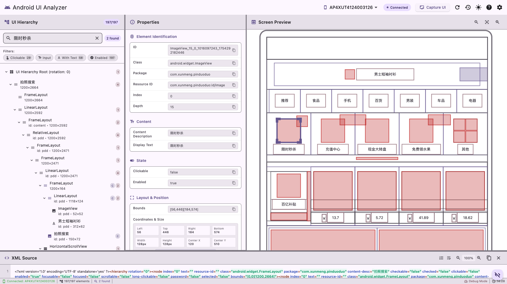

# Android UI 분석 도구

[English](README.md) | [中文](README.zh.md) | [Deutsch](README.de.md) | [한국어](README.ko.md) | [日本語](README.ja.md)

---

XML 덤프 파일에서 Android UI 계층 구조를 분석하기 위한 강력한 Flutter 데스크톱 애플리케이션입니다. 이 도구는 개발자가 UI 구조를 이해하고, 레이아웃 문제를 디버깅하며, UI 자동화 테스트 개발을 가속화하는 데 도움을 줍니다.



## 기능

### 핵심 기능
- **🔍 UI 계층 구조 시각화**: Android UI 구조의 인터랙티브 트리 뷰
- **🔎 고급 검색 및 필터링**: 텍스트, 리소스 ID, 클래스 이름 또는 속성으로 요소 찾기
- **📊 속성 검사**: UI 요소 속성 및 경계의 상세 뷰
- **🖼️ 시각적 미리보기**: 요소 하이라이팅이 있는 스케일된 디바이스 화면 표현
- **📝 XML 보기**: 내보내기 기능이 있는 구문 강조 XML 표시
- **📚 기록 관리**: 이전에 캡처된 UI 덤프에 대한 액세스 및 관리

### 주요 이점
- UI 자동화 테스트 개발 가속화
- 복잡한 레이아웃 계층 구조 디버깅
- 접근성 구조 이해
- 추가 분석을 위한 데이터 내보내기
- 모바일 앱 테스트 워크플로우 간소화

## 빠른 시작

### 사전 요구사항
- macOS 10.14 이상
- USB 디버깅이 활성화된 Android 디바이스
- ADB(Android Debug Bridge) 설치됨

### 설치
1. [릴리스](https://github.com/your-repo/releases)에서 최신 버전 다운로드
2. 압축 해제하고 Applications 폴더로 이동
3. 애플리케이션 실행
4. Android 디바이스를 연결하고 분석 시작!

### 기본 사용법
1. **디바이스 연결**: USB 디버깅이 활성화된 Android 디바이스
2. **UI 캡처**: "UI 캡처"를 클릭하여 현재 화면 계층 구조 가져오기
3. **탐색**: 트리 뷰, 검색 및 필터를 사용하여 요소 찾기
4. **검사**: 요소를 클릭하여 상세 속성 보기
5. **내보내기**: 자동화 스크립트용 XML 파일 저장

## 문서

- **[사용자 가이드](docs/USER_GUIDE.md)**: 완전한 사용자 문서
- **[개발자 가이드](docs/DEVELOPER_GUIDE.md)**: 기술 구현 세부사항
- **[배포 가이드](docs/DEPLOYMENT_GUIDE.md)**: 빌드 및 배포 지침
- **[테스트 보고서](docs/TEST_REPORT.md)**: 포괄적인 테스트 검증

## 프로젝트 구조

```
lib/
├── main.dart                 # 애플리케이션 진입점
├── controllers/              # 상태 관리 및 비즈니스 로직
│   ├── ui_analyzer_state.dart
│   ├── search_controller.dart
│   └── filter_controller.dart
├── models/                   # 데이터 모델 및 엔티티
│   ├── ui_element.dart
│   ├── android_device.dart
│   └── filter_criteria.dart
├── services/                 # 외부 서비스 통합
│   ├── adb_service.dart
│   ├── xml_parser.dart
│   ├── file_manager.dart
│   └── user_preferences.dart
├── ui/                       # 사용자 인터페이스 구성 요소
│   ├── panels/              # 메인 UI 패널
│   ├── widgets/             # 재사용 가능한 구성 요소
│   ├── dialogs/             # 모달 대화상자
│   └── themes/              # 테마 구성
└── utils/                   # 유틸리티 함수 및 헬퍼

test/                        # 포괄적인 테스트 스위트
docs/                        # 문서
```

## 개발

### 사전 요구사항
- Flutter SDK 3.7.2+ (FVM을 통한 관리 권장)
- Dart SDK 2.19.0+
- macOS 개발 환경
- Xcode (macOS 빌드용)

### 설정
```bash
# 저장소 클론
git clone <repository-url>
cd android-ui-analyzer

# 의존성 설치
fvm flutter pub get

# 애플리케이션 실행
fvm flutter run -d macos
```

### 개발 명령어
```bash
# 코드 분석
fvm flutter analyze

# 테스트 실행
fvm flutter test

# 통합 테스트 실행
fvm flutter test test/integration/

# 릴리스 빌드
fvm flutter build macos --release
```

### 테스팅
프로젝트는 포괄적인 테스팅을 포함합니다:
- **단위 테스트**: 핵심 비즈니스 로직 검증
- **통합 테스트**: 엔드투엔드 기능 검증
- **위젯 테스트**: UI 구성 요소 동작 테스팅

테스트 스위트 실행:
```bash
# 모든 테스트
fvm flutter test

# 특정 테스트 파일
fvm flutter test test/integration/final_integration_test.dart

# 커버리지 포함
fvm flutter test --coverage
```

## 아키텍처

### 클린 아키텍처 패턴
- **UI 레이어**: Flutter 위젯 및 패널
- **비즈니스 로직**: 컨트롤러 및 상태 관리
- **데이터 레이어**: 서비스 및 저장소
- **외부**: ADB 통합 및 파일 시스템

### 주요 기술
- **Flutter**: 크로스 플랫폼 UI 프레임워크
- **Provider**: 상태 관리
- **XML**: Android UI 덤프 파싱
- **ADB**: Android 디바이스 통신
- **Material Design 3**: 현대적인 UI 구성 요소

## 기여

기여를 환영합니다! 기여 가이드라인을 참조하세요:

1. 저장소 포크
2. 기능 브랜치 생성
3. 테스트와 함께 변경사항 만들기
4. 풀 리퀘스트 제출

### 코드 스타일
- Dart 스타일 가이드 준수
- 공개 API에 대한 문서 추가
- 새 기능에 대한 테스트 포함
- 의미 있는 커밋 메시지 사용

## 성능

### 벤치마크
- **XML 파싱**: 일반적인 UI 덤프 < 500ms
- **검색**: < 100ms 응답 시간
- **메모리 사용량**: 대용량 계층 구조에 최적화
- **UI 반응성**: 60fps 부드러운 상호작용

### 최적화 기능
- 대용량 트리를 위한 지연 로딩
- 성능을 위한 가상 스크롤링
- 지연을 방지하기 위한 디바운스 검색
- 효율적인 메모리 관리

## 보안

### 데이터 보호
- 민감한 데이터 전송 없음
- 로컬 파일 처리만
- 안전한 임시 파일 처리
- 개인정보 보호 중심 설계

### 모범 사례
- 입력 검증 및 정리
- 안전한 XML 파싱
- 적절한 오류 처리
- 리소스 정리

## 호환성

### 지원 플랫폼
- **주요**: macOS 10.14+
- **Android 디바이스**: API 16+ (Android 4.1+)
- **ADB 버전**: 모든 최신 버전

### 테스트된 구성
- 다양한 Android 디바이스 제조업체
- 다른 화면 크기 및 방향
- 복잡한 UI 계층 구조 및 레이아웃
- 여러 Android 버전

## 문제 해결

### 일반적인 문제
- **디바이스가 감지되지 않음**: USB 디버깅 및 ADB 설치 확인
- **UI 캡처 실패**: 디바이스가 잠금 해제되고 앱에 권한이 있는지 확인
- **성능 문제**: 필터를 사용하여 표시된 요소 줄이기

자세한 문제 해결은 [사용자 가이드](docs/USER_GUIDE.md)를 참조하세요.

## 라이선스

이 프로젝트는 MIT 라이선스 하에 라이선스됩니다 - 자세한 내용은 [LICENSE](LICENSE) 파일을 참조하세요.

## 감사의 말

- 훌륭한 프레임워크를 제공한 Flutter 팀
- UIAutomator 도구를 제공한 Android 팀
- 의존성을 제공한 오픈 소스 커뮤니티
- 기여자 및 테스터

## 지원

- **문서**: docs/ 디렉토리 확인
- **문제**: 버그 보고를 위해 GitHub Issues 사용
- **토론**: 질문을 위해 GitHub Discussions 사용
- **이메일**: [support@example.com](mailto:support@example.com)

---

**Android 개발자 및 테스터를 위해 ❤️로 제작됨** 