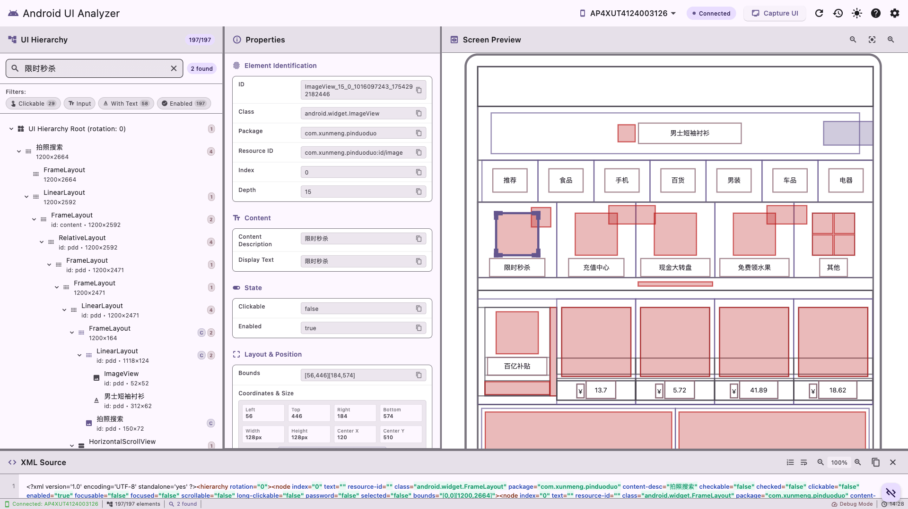

# Android UI Analyzer Tool

A powerful Flutter desktop application for analyzing Android UI hierarchies from XML dump files. This tool helps developers understand UI structures, debug layout issues, and accelerate UI automation test development.



## Features

### Core Functionality
- **🔍 UI Hierarchy Visualization**: Interactive tree view of Android UI structures
- **🔎 Advanced Search & Filtering**: Find elements by text, resource ID, class name, or properties
- **📊 Property Inspection**: Detailed view of UI element attributes and bounds
- **🖼️ Visual Preview**: Scaled device screen representation with element highlighting
- **📝 XML Viewing**: Syntax-highlighted XML display with export capabilities
- **📚 History Management**: Access and manage previously captured UI dumps

### Key Benefits
- Accelerate UI automation test development
- Debug complex layout hierarchies
- Understand accessibility structures
- Export data for further analysis
- Streamline mobile app testing workflows

## Quick Start

### Prerequisites
- macOS 10.14 or later
- Android device with USB debugging enabled
- ADB (Android Debug Bridge) installed

### Installation
1. Download the latest release from [Releases](https://github.com/your-repo/releases)
2. Extract and move to Applications folder
3. Launch the application
4. Connect your Android device and start analyzing!

### Basic Usage
1. **Connect Device**: USB debugging enabled Android device
2. **Capture UI**: Click "Capture UI" to get current screen hierarchy
3. **Explore**: Use tree view, search, and filters to find elements
4. **Inspect**: Click elements to view detailed properties
5. **Export**: Save XML files for automation scripts

## Documentation

- **[User Guide](docs/USER_GUIDE.md)**: Complete user documentation
- **[Developer Guide](docs/DEVELOPER_GUIDE.md)**: Technical implementation details
- **[Deployment Guide](docs/DEPLOYMENT_GUIDE.md)**: Build and distribution instructions
- **[Test Report](docs/TEST_REPORT.md)**: Comprehensive testing validation

## Project Structure

```
lib/
├── main.dart                 # Application entry point
├── controllers/              # State management and business logic
│   ├── ui_analyzer_state.dart
│   ├── search_controller.dart
│   └── filter_controller.dart
├── models/                   # Data models and entities
│   ├── ui_element.dart
│   ├── android_device.dart
│   └── filter_criteria.dart
├── services/                 # External service integrations
│   ├── adb_service.dart
│   ├── xml_parser.dart
│   ├── file_manager.dart
│   └── user_preferences.dart
├── ui/                       # User interface components
│   ├── panels/              # Main UI panels
│   ├── widgets/             # Reusable components
│   ├── dialogs/             # Modal dialogs
│   └── themes/              # Theme configuration
└── utils/                   # Utility functions and helpers

test/                        # Comprehensive test suite
docs/                        # Documentation
```

## Development

### Prerequisites
- Flutter SDK 3.7.2+ (managed via FVM recommended)
- Dart SDK 2.19.0+
- macOS development environment
- Xcode (for macOS builds)

### Setup
```bash
# Clone repository
git clone <repository-url>
cd android-ui-analyzer

# Install dependencies
fvm flutter pub get

# Run the application
fvm flutter run -d macos
```

### Development Commands
```bash
# Code analysis
fvm flutter analyze

# Run tests
fvm flutter test

# Run integration tests
fvm flutter test test/integration/

# Build for release
fvm flutter build macos --release
```

### Testing
The project includes comprehensive testing:
- **Unit Tests**: Core business logic validation
- **Integration Tests**: End-to-end functionality verification
- **Widget Tests**: UI component behavior testing

Run the test suite:
```bash
# All tests
fvm flutter test

# Specific test file
fvm flutter test test/integration/final_integration_test.dart

# With coverage
fvm flutter test --coverage
```

## Architecture

### Clean Architecture Pattern
- **UI Layer**: Flutter widgets and panels
- **Business Logic**: Controllers and state management
- **Data Layer**: Services and repositories
- **External**: ADB integration and file system

### Key Technologies
- **Flutter**: Cross-platform UI framework
- **Provider**: State management
- **XML**: Android UI dump parsing
- **ADB**: Android device communication
- **Material Design 3**: Modern UI components

## Contributing

We welcome contributions! Please see our contributing guidelines:

1. Fork the repository
2. Create a feature branch
3. Make your changes with tests
4. Submit a pull request

### Code Style
- Follow Dart style guide
- Add documentation for public APIs
- Include tests for new features
- Use meaningful commit messages

## Performance

### Benchmarks
- **XML Parsing**: < 500ms for typical UI dumps
- **Search**: < 100ms response time
- **Memory Usage**: Optimized for large hierarchies
- **UI Responsiveness**: 60fps smooth interactions

### Optimization Features
- Lazy loading for large trees
- Virtual scrolling for performance
- Debounced search to prevent lag
- Efficient memory management

## Security

### Data Protection
- No sensitive data transmitted
- Local file processing only
- Secure temporary file handling
- Privacy-focused design

### Best Practices
- Input validation and sanitization
- Secure XML parsing
- Proper error handling
- Resource cleanup

## Compatibility

### Supported Platforms
- **Primary**: macOS 10.14+
- **Android Devices**: API 16+ (Android 4.1+)
- **ADB Versions**: All modern versions

### Tested Configurations
- Various Android device manufacturers
- Different screen sizes and orientations
- Complex UI hierarchies and layouts
- Multiple Android versions

## Troubleshooting

### Common Issues
- **Device not detected**: Check USB debugging and ADB installation
- **UI capture fails**: Ensure device is unlocked and app has permissions
- **Performance issues**: Use filters to reduce displayed elements

See the [User Guide](docs/USER_GUIDE.md) for detailed troubleshooting.

## License

This project is licensed under the MIT License - see the [LICENSE](LICENSE) file for details.

## Acknowledgments

- Flutter team for the excellent framework
- Android team for UIAutomator tools
- Open source community for dependencies
- Contributors and testers

## Support

- **Documentation**: Check the docs/ directory
- **Issues**: Use GitHub Issues for bug reports
- **Discussions**: GitHub Discussions for questions
- **Email**: [support@example.com](mailto:support@example.com)

---

**Made with ❤️ for Android developers and testers**